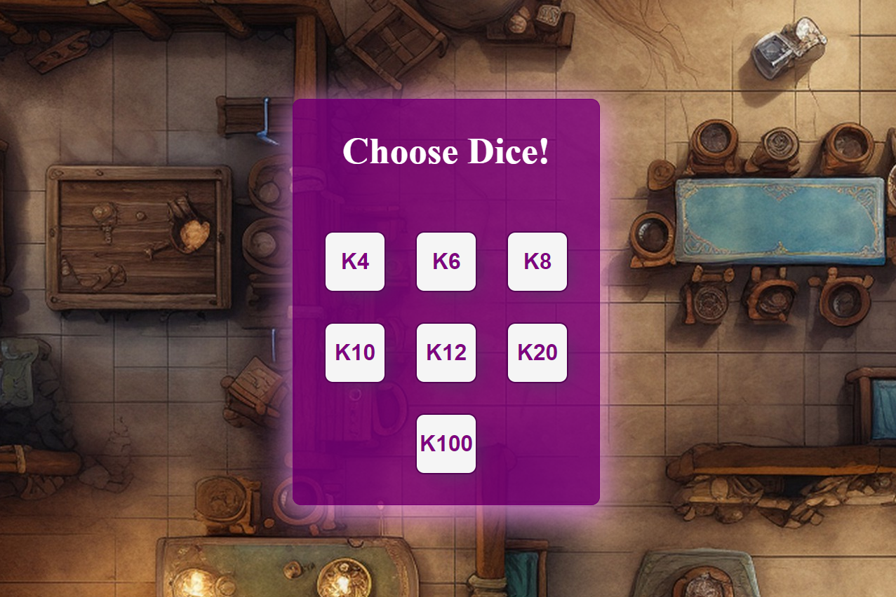

<h1 align="center">Roll100Dice</h1>
<p>
  
</p>

> This application is for everyone who loves tabletop role-playing games.

###

## General Information

```sh
If you dont have phisical rpg dice or you dont want use it this app help You in your rpg session. You could roll all kind of dice, from 4d to 100d.
```
## Technologies Used


## Features

<ul>
<li>All types of dice</Li>
<li>Intuitive and easy for users</Li>
<li>For all kinds of devices</Li>
</ul>

## Screenshots



## Project Status

In progress.

## Room for Improvement

<ul>
<li>I think about possibility to roll more then one dice</Li>
</ul>

## Acknowledgements

This project was inspired by my tabletop gaming experiance. I needed simple and very quick to use app for all kinds dice test in rpg session. The application on the app shop have to many option and not intitive menu. When you play, you want to roll the dice asap and immediately return to game.

## Author

👤 **Artur Molenda**

* Github: [@jesiennart](https://github.com/jesiennart)

## Contact

Email: artmol@op.pl
